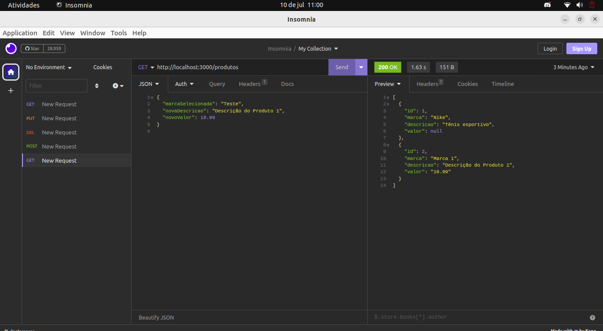
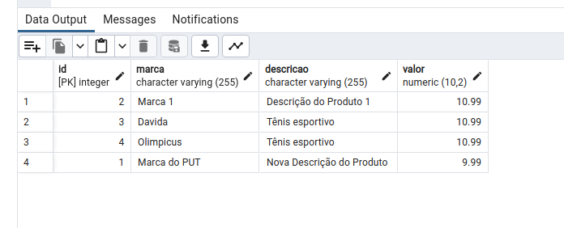

# API para sistema de cadastro de marca e produto

#### Essa API tem como objetivo integrar o projeto sistema de cadastro de marcas e produto com um banco de dados remoto. Nesse projeto uso o Render e o postgresql pela facilidade e disponibilidade para um armazenamento sem custo. Esse projeto está em desenvolvimento no presente momento."


## Índice

- [Imagens de testes](#imagens-de-testes)
- [Construído com](#construído-com)
- [O que aprendi](#o-que-aprendi)
- [Desenvolvimento contínuo](#desenvolvimento-contínuo)
- [Fernando Mendes](#autor)

## Imagens de testes






## Construído com

<div style="display: inline_block"><br>
  
      
</div>
                    

## O que aprendi

Esse projeto possibilitou um desenvolvimento significativo do desenvolvimento web backend. A integração com banco de dados e o uso de ferramentas para testar requisição, além de muitos outros recursos foram de fundamental importância para consolidar e desenvolver novos conhecimentos.

## Trechos de códigos

``` 

app.post('/marcas', (req, res) => {
  const { novaMarca } = req.body;
  pool.query('INSERT INTO marcas (nome) VALUES ($1)', [novaMarca], (err, result) => {
    if (err) {
      console.error('Erro ao inserir marca:', err);
      res.sendStatus(500);
    } else {
      res.sendStatus(201);
    }
  });
});

app.post('/produtos', (req, res) => {
  const { marcaSelecionada, novaDescricao, novoValor } = req.body;
  pool.query(
    'INSERT INTO produtos (marca, descricao, valor) VALUES ($1, $2, $3)',
    [marcaSelecionada, novaDescricao, novoValor],
    (err, result) => {
      if (err) {
        console.error('Erro ao inserir produto:', err);
        res.sendStatus(500);
      } else {
        res.sendStatus(201);
      }
    }
  );
});

```

## Desenvolvimento contínuo

Pretendo continuar focado em construir um conhecimento sólido nessas limguagens. Ainda há muitos conceitos importantes para serem desenvolvidos. Todos os dias são gradativamente adicionados ao meu repertório de ferramentas.


## Autor

[Fernando Mendes](https://www.linkedin.com/in/fernandomendesti/)


